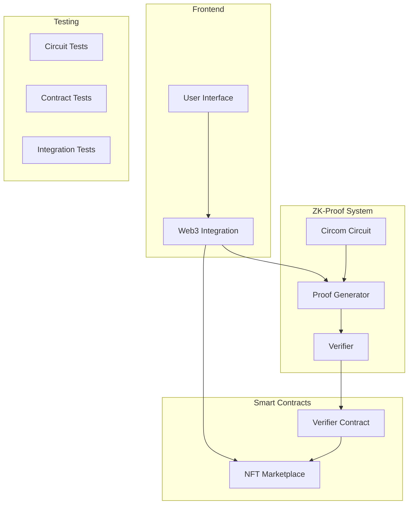

# ZK-NFT Marketplace

A zero-knowledge proof-based NFT marketplace implementing privacy-preserving transactions using circom and snarkjs.

## Architecture Diagram



## Features

- Private NFT transactions with zero-knowledge proofs
- On-chain verification of ZK proofs
- Secure listing and purchasing mechanisms
- Reentrancy protection
- Comprehensive test coverage

## Prerequisites

- Node.js (>= 14.0.0)
- Hardhat
- circom (>= 2.1.4)
- snarkjs
- Solidity (^0.8.9)

## Project Structure

```
zk-nft-marketplace/
├── circuits/
│   └── marketplace.circom
├── contracts/
│   ├── NFTMarketplace.sol
│   └── NFTMarketplaceVerifier.sol
├── scripts/
│   ├── compile-circuit.js
│   ├── deploy.js
│   ├── generate-proof.js
│   └── verify-proof.js
├── test/
│   ├── NFTMarketplace.test.js
│   └── zkproof.test.js
├── build/
└── README.md
```

## Setup & Installation

1. Clone the repository:

```bash
git clone https://github.com/yourusername/zk-nft-marketplace.git
cd zk-nft-marketplace
```

2. Install dependencies:

```bash
npm install
```

3. Compile Circuits:

```bash
npm run compile
```

4. Generate proving key and verification key:

```bash
npm run setup
```

## Testing

Run all tests:

```bash
npm test
```

Run specific test suites:

```bash
npx hardhat test test/NFTMarketplace.test.js
npx hardhat test test/zkproof.test.js
```

## Deployment

1. Configure network in hardhat.config.js

2. Set environment variables:

```bash
cp .env.example .env
# Edit .env with your configuration
```

3. Deploy contracts:

```bash
npm run deploy
```

## Usage

### Creating a Listing

```javascript
const price = ethers.utils.parseEther("1.0");
await marketplace.createListing(nftContract, tokenId, price);
```

### Purchasing with ZK Proof

```javascript
const inputs = {
  nftTokenId: tokenId,
  listingPrice: price,
  currentOwner: seller,
  buyerBalance: balance,
};

const { proof, publicSignals } = await generateProof(inputs);
await marketplace.purchaseWithProof(listingId, proof, publicSignals);
```
